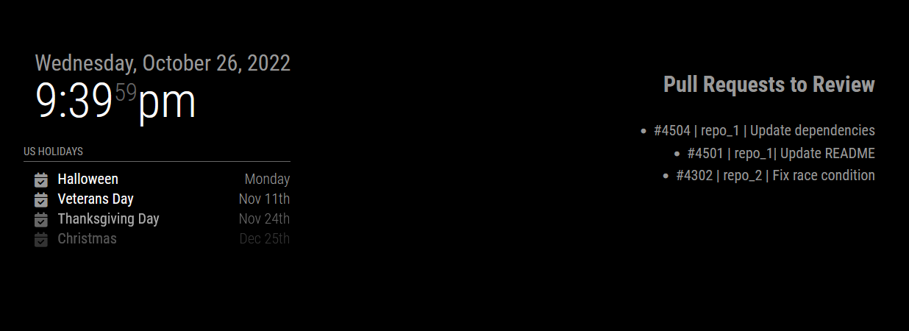

# MMM-GitHub-PRs

A MagicMirror² module for displaying pull requests awaiting your review

## Preview



## Using the module

Clone the repo into your `MagicMirror/modules` folder.

You will need to create a [personal access token](https://github.com/settings/tokens) with repo access.

Add a `github-prs` section to the `modules` array in `config/config.js`:

```javascript
modules: [
  {
    module: "github-prs",
    position: "top_right",
    config: {
      rootUrl: "", // Optional, defaults to https://github.com, can use a GitHub Enterprise URL
      accessToken: "", // Required, personal access token
      login: "", // Required, GitHub username
      maxPullRequests: 20, // Optional, defaults to 20
    },
  },
];
```
